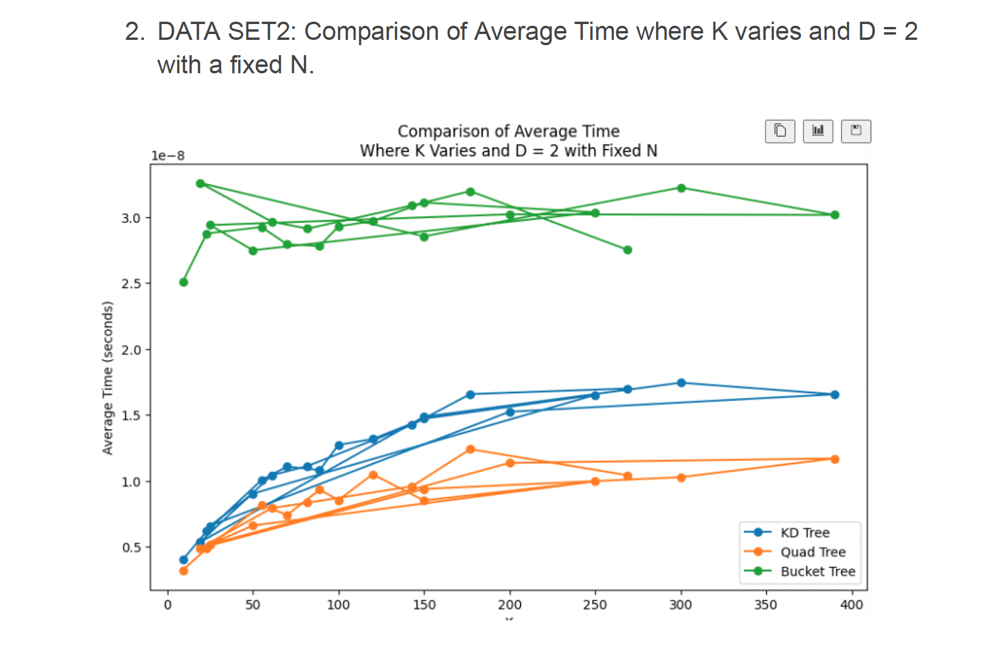
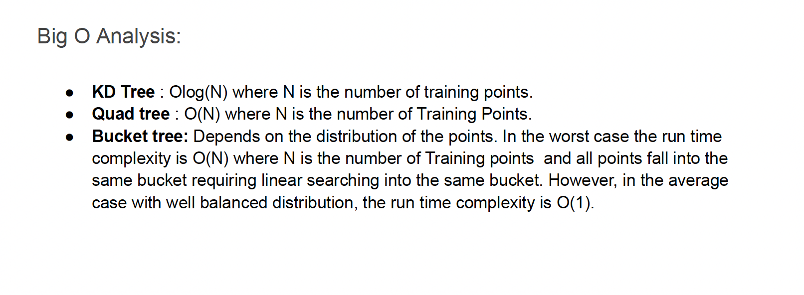

# SpatialDataStructuresAnalysis

## Implementation and Evaluation Spatial Partitioning Data Structures

* KD Trees
* Quad Trees
* Bucket Trees

## Implementation

In this section, we will provide an overview of the three spatial partitioning data structures implemented in this project: KD Tree, Quad Tree, and Bucket KNN.

### KD Tree

The KD Tree is a space-partitioning data structure that organizes points in multidimensional space. In my implementation, I used a compile-time parameter to specify the splitting dimension ( a D lang feature), allowing for efficient memory usage and compile-time error checking.

#### Node Structure

Our KD Tree implementation includes a `Node` class, which has the following attributes:

- `splitDimension`: Specifies the dimension along which the node splits points.
- `left` and `right`: Child nodes representing the partitions of the space.

#### Query Methods

We provide two query methods for the KD Tree:

1. `rangeQuery(P2 p, float r)`: Returns all points within a specified radius `r` of a given point `p`.
2. `KNNQuery(P2 p, size_t k)`: Returns the `k` nearest neighbors to a given point `p`.

### Quad Tree

The Quad Tree is a two-dimensional spatial partitioning data structure. It's simpler than the KD Tree and works only in 2D space.

#### Node Structure

Our Quad Tree implementation includes a `Node` class, which has the following attributes:

- `points`: A list of points if it's a leaf node.
- `children`: An array of 4 child nodes if it's an internal node.
- `AABB` (Axis-Aligned Bounding Box): Describes the area covered by the node.

#### Query Methods

We provide two query methods for the Quad Tree:

1. `rangeQuery(P2 p, float r)`: Returns all points within a specified radius `r` of a given point `p`.
2. `KNNQuery(P2 p, size_t k)`: Returns the `k` nearest neighbors to a given point `p`.

### Bucket KNN

Bucket KNN is a spatial partitioning data structure that divides space into buckets (a uniform grid) and stores points within each bucket.

#### Implementation Details

Our Bucket KNN implementation employs a dense array to store buckets. To perform queries, we determine which buckets are of interest and then loop through all the points in those buckets. Alternatively, you can use spatial hashing and store buckets in a hash table.

## Testing

In this section, we detail our comprehensive testing strategy to evaluate the performance and behavior of the implemented spatial partitioning data structures: KD Tree, Quad Tree, and Bucket KNN. Our goal is to understand how the KNN (K-Nearest Neighbors) query performance is influenced by various factors.

### Factors Investigated

I conducted a series of tests to investigate the impact of the following factors on KNN query performance:

1. **k (Number of Nearest Neighbors)**: I varied the value of k to understand how it affects query execution time.
2. **N (Total Number of Points)**: The total number of data points in our dataset was adjusted to explore its effect on query performance.
3. **D (Dimension of Data)**: Since Quad Trees are designed for two-dimensional data, we restricted our experiments to D=2 to analyze the behavior of Quad Trees in 2D space.

### Additional Parameters Explored

While investigating the primary factors, we also experimented with the following parameters to fine-tune our data structures:

- **Bucket Divisions (for Bucket KNN)**: We explored different approaches for choosing the number of bucket divisions to optimize the performance of Bucket KNN.
- **Maximum Leaf Size (for Quad Tree)**: We adjusted the maximum leaf size in the Quad Tree to determine its impact on query efficiency.

### Test Data

To ensure the reliability of our results, we tested our data structures with two types of data distributions:

1. **Uniformly Distributed Data Points**: Data points were evenly distributed across the space.
2. **Gaussian Distributed Data Points**: Data points followed a Gaussian distribution, resulting in clustering around the mean.

### Noise Reduction and Data Collection

To reduce noise in our measurements, we employed the following strategies:

- Multiple Trials: We timed each experiment by performing multiple KNN queries (10 or 100) and computed the average execution time.
- Repetition: Each experiment was repeated multiple times with different random points, enhancing the reliability of our results.
- Data Logging: We recorded the timing results for each trial in a CSV file, including multiple rows with the same k, N, and D values but different timings. This allowed us to track the variability in query execution times.

### Test Data Sets

We organized our testing into three distinct data sets to systematically investigate the factors:

1. **Varying k, N, or D**: In this data set, we isolated one factor at a time, keeping the others constant. This allowed us to understand the individual impact of k, N, and D.
2. **Fixed D (2D), Varying k and N**: Here, we maintained a fixed two-dimensional space (D=2) and varied both k and N simultaneously, exploring multiple combinations.

### Test Execution Time

To keep our test suite manageable, we aimed for a total runtime of 1-2 minutes, ensuring we had a substantial amount of timing data while maintaining efficiency.

The results of our extensive testing are available in the pdf files provided in the repository. Detailed insights and analysis can be found in accompanying Jupyter notebooks.

This comprehensive testing approach provides users with valuable insights into the performance characteristics of our spatial partitioning data structures under different scenarios, helping them make informed choices when utilizing these structures in their projects.

## Analysis

In this section, we extract key insights from our testing data and confirm our expectations regarding the impact of factors on query performance:

- **K (Number of Nearest Neighbors)**: As expected, query times increase with larger values of k. Larger k requires more extensive searching, resulting in longer query times.
- **N (Total Number of Points)**: Increasing N leads to longer query times. Larger datasets impose a greater computational load.
- **D (Dimension of Data)**: Quad Trees perform optimally in 2D space, while KD Trees are versatile across dimensions.

### Regression Analysis

- **KD Tree**: Our tests confirm the expected logarithmic query times (O(log N)), highlighting KD Trees' efficiency, especially as N grows.
- **Quad Tree**: In 2D space, Quad Trees align with our expectations, showing increased query times with larger N and k.
- **Bucket KNN**: The choice of bucket divisions significantly impacts performance, confirming our expectations that optimization improves query efficiency.

### Notable Observations

- **Bucket KNN and Data Distribution**: Bucket KNN is sensitive to data distribution. Clustering around the mean (Gaussian distribution) increases query times, suggesting limitations with highly clustered data.
- **Outliers**: Some experiments yielded outliers in query times, attributed to factors like random point distribution and query nature.

For detailed visualizations and metrics, please refer to the [Report_Analysis](https://github.com/gloriadukuzeyesu/SpatialDataStructuresAnalysis/blob/main/Report_Analysis.pdf) file in the repository. 

